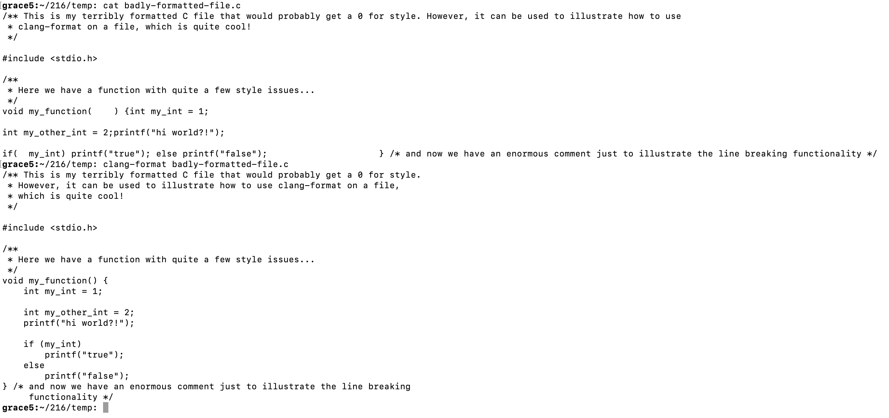

# Setting Up Clang Format

## Download `clang-format` to GRACE
1. Connect to GRACE over SSH.
2. Create a destination folder for `clang-format` by issuing `mkdir -p ~/bin/linux/x86_64`. 
3. Download `clang-format` by issuing `wget 'https://drive.google.com/uc?export=download&id=1t54u1qK6lsDlF60t13CQ3r1kVvQTbQSW' -O ~/bin/linux/x86_64/clang-format`.
4. Make `clang-format` executable with `chmod +x ~/bin/linux/x86_64/clang-format`
5. Validate that `clang-format` is installed by issuing `clang-format --version`.
    - If all has gone well, you should see something along the lines of `clang-format version 10.0.0 ... some other stuff ...`. 
6. `clang-format` is now installed.

## Configure `clang-format` according to UMD guidelines.
1. `clang-format` requires that you feed it something known as a configuration file, which basically tells `clang-format` what you want it to do.
2. However, I already made this file at the beginning of the semester, and (so far) have not lost any style points.
3. `cd` into your project folder (the folder that actually contains your C code), and download my config using `wget 'https://drive.google.com/uc?export=download&id=1u3jXnoPk8QdW8-t7zq6AMzr9FBnxGadH' -O .clang-format`
4. You will have to copy this `.clang-format` file to every new project that you start. You could also just put the file in a single place, then invoke `clang-format` with the path to this file every time, but that's a lot harder than just creating a copy of the file for each folder. 

## Try `clang-format` on a file
1. `clang-format` doesn't actually write to the file that you run it on - it just prints the formatted file to `stdout`.
2. For example, if I wanted to format `badly-formatted-file.c`:

3. As you can see, it formats the file and prints out the result.
4. If I wanted to actually write the result back to the file, then:
    - `clang-format badly-formatted-file.c > formatted.c`
    - Open `formatted.c` in an editor to validate that everything went properly
    - `mv formatted.c badly-formatted-file.c` to overwrite the original file.